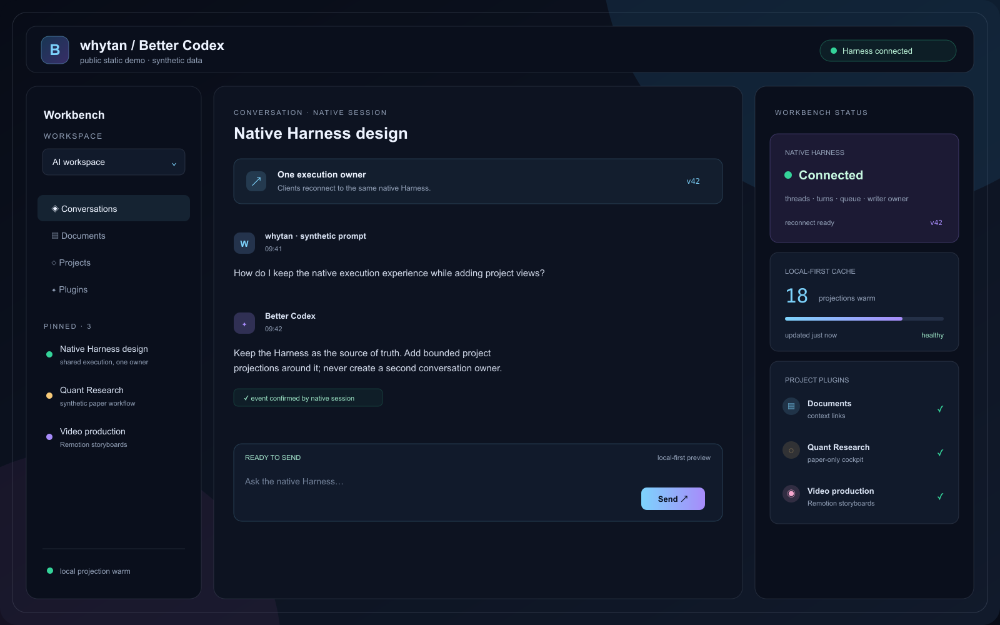
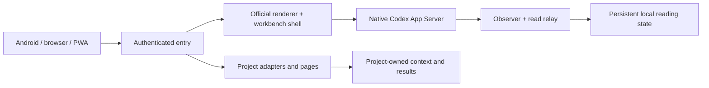

# Better Codex

[中文](README.zh-CN.md) · [Install](docs/open-source-setup.md) · [Project plugins](docs/plugins.md) · [Validation](docs/portable-validation.md)

**Your native Codex, with a workbench shaped around your projects.**

Better Codex brings conversations, project context and the tools you build into one workbench. Run the host on your Mac, use the familiar official conversation interface, and return to the same work from a browser or phone. The official Native Harness remains responsible for execution, tools, approvals and conversation history.

The project grew from everyday remote use in China: slow reconnects, repeated history loading and project tools scattered across pages. Its focus is faster local access, reliable state reconciliation and a workbench you can extend. The author's deployment experience informs that goal; this repository does not claim a controlled performance ranking against official Remote or other Harness implementations.



*Illustrative architecture overview. The gallery and demo contain synthetic data; they are separate from installation and runtime acceptance.*

## What you can do

- **Keep native Codex execution.** Use your existing official Codex login through the local App Server. Models, tools, approvals and account limits remain governed by that host and your account. Better Codex does not sell another model service or turn a model API into a replacement Harness.
- **Continue the same work across devices.** Open a project or conversation on your Mac, then reach that host from a phone through private Tailscale Serve or an authenticated HTTPS relay. The Mac must remain awake and the host running for remote execution.
- **Return to saved content first.** Persisted local history, conversation state and drafts provide the first view while current state reconciles in the background. Opening the application recreates the view; it should not require downloading unchanged history again. A saved view is a reading aid, not proof that a new command succeeded.
- **Keep the work you are using first.** Foreground conversation reads and control traffic have separate paths from bulk history preparation. Pinned conversations and recent history have distinct priorities; the recent preparation window is 20 conversations. Storing history does not require rendering every saved conversation in memory.
- **Build your own project workbench.** Register adapters, documents and embedded local pages for your projects. Connect project-owned context and results to the conversation without making the shell another business database. Plugins have their own packages and can evolve independently of the core shell.
- **See what is happening.** Connection state, cache state and bounded diagnostics help distinguish waiting for a connection, writing a command, reading history and displaying a result. A transport acknowledgment and a Native task completion are separate states.

Agenda, travel, investment research and video production illustrate the plugin idea in the product presentation. Their private integrations are not bundled. The public `project-overview` example reads directory names from a workspace you choose; it is a starting point for your own adapter.

## Start on a Mac

Install the official Codex desktop application and sign in. Then [download the Mac installer source ZIP](https://github.com/TonyandWei/better-codex/releases/download/v0.2.0-beta.4/Better-Codex-v0.2.0-beta.4-mac.zip), extract it to a stable location, and double-click `Install.command`. The first installation downloads and verifies dependencies.

Or use a terminal:

```sh
git clone https://github.com/TonyandWei/better-codex.git
cd better-codex
./install.sh --workspace "$HOME/Code"
"$HOME/.better-codex/start"
```

Open `http://127.0.0.1:4173/?workspace=ai`. Keep the foreground host terminal open; Ctrl-C stops the processes that invocation owns. Setup can install its own Node and Go without a global toolchain or a launch agent. Keep the source folder at its installed location.

### Reach it from a phone

For private Tailscale access, sign in to Tailscale on both devices. Stop Better Codex before changing access settings:

```sh
"$HOME/.better-codex/better-codex" tailscale --enable
"$HOME/.better-codex/start"
```

Open the printed HTTPS `ts.net` URL and add it to the phone's home screen. The entry checks an explicit login allowlist, workspace and origin. Serve remains inside your tailnet; the installer does not enable Funnel or replace conflicting routes.

For an HTTPS domain without Tailscale on the phone, use the optional `better-codex cvm` profile. It prepares an authenticated Caddy entry and a reverse SSH tunnel to your Mac. You provide the server, domain and credentials; the CLI does not deploy them remotely. [CVM setup](docs/cvm-deployment.md).

For Android, [build an origin-pinned native client](docs/android.md) with device-local SQLite storage and native lifecycle integration. Its initial pairing target is your Mac's HTTPS Tailscale Serve origin. You supply the UI package and signing key; this release does not provide the maintainer's APK. Android HTTP Basic handoff for the CVM route and physical-device pairing remain unverified. The Mac setup above installs the host and browser entry, not an Android application.

## Make it fit your projects

`~/.better-codex/deployment.json` is the installation's workspace and plugin registry. It controls roots, display names, ports, access policy and enabled plugins. Stop the host before editing it; run `doctor` and restart afterward.

A plugin can return a small document or embed its own local page. Its adapter reads the project's authoritative data. A write must carry a request ID and expected source revision, and the source system implements authorization and the transaction. The workbench forwards the invocation rather than inventing a second editable copy of the project.

Start with [`examples/plugins/project-overview`](examples/plugins/project-overview) and the [plugin contract](docs/plugins.md). Plugins are trusted local code with host permissions, not a sandbox for untrusted packages. DSH-style designs can be adapted by rebinding their imports, routes, schemas and data sources; private plugins are not drop-in binaries. [Compatibility details](docs/dsh-compatibility.zh-CN.md).

## How the pieces fit



Native owns threads, turns, execution and writer locking. The Mac relay keeps rebuildable reading projections. Clients retain their own saved reading state and reconcile versioned updates; cached content cannot authorize a model turn. The command journal records receipts and uncertain results, rather than silently starting another task after reconnecting.

The shell adds navigation, persistence and plugin entry points around the official renderer. The installer obtains pinned first-party resources and prepares compatibility assets locally. OpenCodex supplies a separate source-built IPC host. This repository and its archives do not redistribute official application or renderer bytes.

See [architecture](docs/architecture.md), [product story](docs/product-story.md) and the [public boundary](docs/public-boundary.md).

## Release scope and verification

This is a beta with a runnable macOS host, browser/PWA delivery and Android client source. Apple Silicon has installation and protocol evidence; Intel is not device-verified. An authenticated local Caddy test is distinct from real cloud certificate issuance and a sustained external tunnel. Android emulator checks are distinct from physical-phone, OEM background and natural battery acceptance.

The public tree carries the applicable generic fixes for send/read isolation, conversation navigation and draft ownership, persistent history and observed progress, image handling, background backoff and diagnostics. Implementation and focused tests do not prove that every network or phone behaves identically. Read [release validation](docs/portable-validation.md) for the actual checks and remaining gaps; the release notes define the downloadable client artifacts.

Official desktop updates can change the IPC or renderer contract and require a compatibility update here. Account capabilities and quotas are not expanded by installing Better Codex. This is a community project, not an official OpenAI product.

## Develop and verify

```sh
npm ci --prefix packages/host-cli --ignore-scripts
node --test packages/host-cli/test/*.test.mjs packages/harness-contract/test/*.test.mjs
(cd source/apps/sync-gateway && go test ./...)
python3 scripts/scan-public-tree.py .
"$HOME/.better-codex/better-codex" doctor
```

`source/` contains the portable core; `packages/host-cli` contains installation and host contracts. The synthetic `apps/demo`, static gallery and Remotion explanation sources are presentation material, not a replacement for the installed product or a signed-in model test. Diagnostic logs and deployment files may contain private operational data; review them before sharing.

## License

Better Codex's own code is [MIT](LICENSE). The separately built OpenCodex integration and its modifications are [AGPL-3.0-only](integrations/opencodex/LICENSE), with the exact upstream revision and patches available. Official resources retain their original terms. See [third-party notices](THIRD_PARTY_NOTICES.md).
