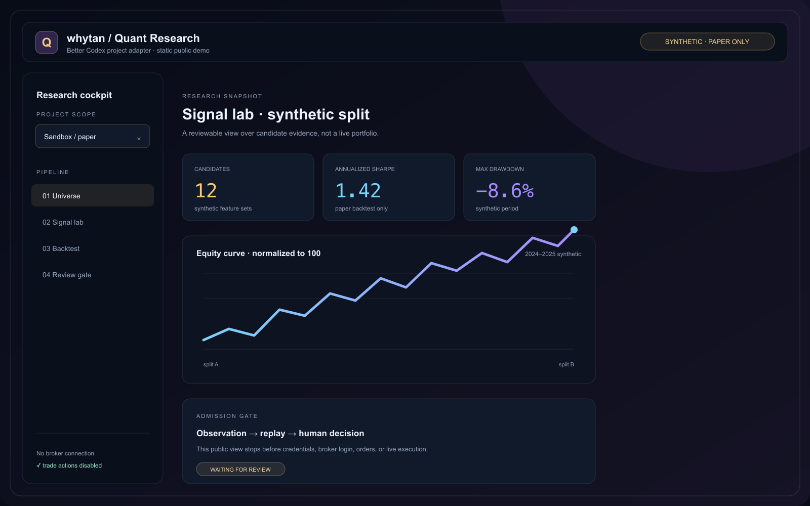
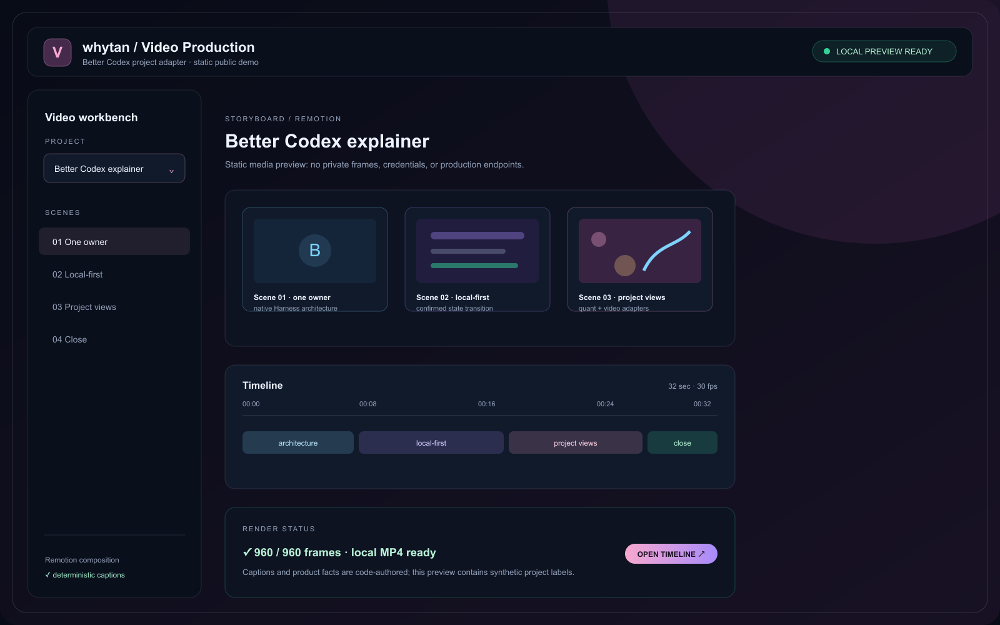

# Better Codex · whytan

[English](README.md) · [中文说明](README.zh-CN.md)

Better Codex is a public reference implementation of a native AI workbench:
one execution owner underneath, local-first interaction on screen, and
project-scoped plugins around the native conversation renderer.

It is a community project by **whytan**. It is not an official OpenAI product,
and it does not ship provider credentials or a provider connector.

## What is here

- `packages/harness-contract` — provider-neutral contracts for a native
  Harness adapter, thread summaries, events, queue controls, and cache
  snapshots.
- `apps/demo` — a zero-login browser demo with a synthetic conversation,
  local-first send, workspace switching, and project plugin cards.
- `source/` — an allow-listed, sanitized reference snapshot of web, sync,
  plugin, and Android integration boundaries.
- `docs/media/` — static, public-safe captures for the workbench, quant
  research, and video production views. Every value in these images is
  synthetic or illustrative.
- `video/` — the deterministic Remotion source project for the explainer.
- [`video/out/better-codex-explainer.mp4`](video/out/better-codex-explainer.mp4)
  — the rendered 32-second explainer.

## Visual showcase

These are static public visuals. They explain the product shape without
exposing real sessions, holdings, symbols, file paths, credentials, endpoints,
or production media.


*Workbench overview — one native Harness with local-first state and scoped
project plugins.*



*Quant Research — synthetic paper-only evidence, with live trading and broker
actions disabled.*



*Video Production — a static Remotion storyboard and local render status.*

See the bilingual visual notes in
[docs/visual-showcase.md](docs/visual-showcase.md).

## Run the demo

```bash
pnpm install
pnpm demo
```

Open <http://localhost:4173>. The demo uses an in-memory mock Harness. No
network request or account is required.

For the complete setup guide, including how to replace the mock Harness and
add a plugin, read [docs/open-source-setup.md](docs/open-source-setup.md).

## Render the explainer

The video uses deterministic React/Remotion scenes for the architecture,
local-first state transitions, project adapters, and UI labels. This keeps the
technical story readable and repeatable.

```bash
pnpm video:install
pnpm video:typecheck
pnpm video:render
```

The generated MP4 is written to `video/out/better-codex-explainer.mp4` and is
kept as the small release artifact in this repository.

## Public boundary

The private implementation contains real sessions, runtime state, credentials,
device release files, and protected service routes. Those are deliberately not
copied here. See [docs/public-boundary.md](docs/public-boundary.md) before
adding an adapter or a deployment example.

The quant and video captures in this README are intentionally synthetic public
demos. They are not a claim that this repository can log into a broker, submit
orders, access a private media library, or deploy a production renderer.

## License

MIT. See [LICENSE](LICENSE).
