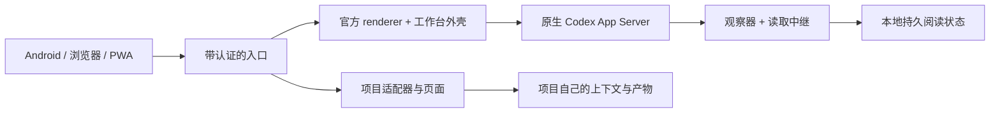

# Better Codex

[English](README.md) · [安装说明](docs/open-source-setup.md) · [项目插件](docs/plugins.md) · [验收范围](docs/portable-validation.md)

**原生 Codex，加上按你的项目与习惯组织的工作台。**

Better Codex 把会话、项目上下文和你自己的工具放在一个工作台里。在 Mac 上运行宿主，沿用熟悉的官方会话界面，从浏览器或手机继续同一份工作。任务执行、工具、审批和会话历史仍由官方原生 Harness 负责。

它来自国内远程使用中的实际问题：连接反复中断、历史重复加载、项目工具散落在不同页面。我们希望本地读取更快、状态同步更稳，工作台也能按自己的需要扩展。作者部署中的使用反馈支持这个方向；仓库没有将这些反馈包装成官方 Remote 或其他 Harness 的受控性能排名。


*机制示意图。公开图集与 Demo 使用合成数据，与真实安装、运行验收分开记录。*

## 它可以帮你做什么

- **继续使用原生 Codex。** 通过本机 App Server 使用已有官方 Codex 登录。模型、工具、审批和账户额度仍由官方宿主与账号决定，工作台不另售模型服务，也不把一个模型 API 当成完整 Harness。
- **让工作在设备之间延续。** 在 Mac 打开项目或会话，从手机经 Tailscale 私网或带认证的 HTTPS 中继访问同一宿主。远程执行需要 Mac 保持唤醒、宿主持续运行。
- **回来先看到已保存内容。** 本地持久化的历史、会话状态和草稿先显示，再在后台同步最新状态。重开 APP 需要重新建立界面，但不应因此重新下载未变化的历史。保存过的阅读内容不代表新命令已成功。
- **优先服务正在使用的会话。** 当前会话读取和控制消息与批量历史准备采用独立路径。置顶和近期会话分开安排优先级，近期准备范围为 20 个；存进本地不等于把所有会话都渲染并留在内存。
- **接入自己的项目工作台。** 为项目注册适配器、文档和本地页面，把资料、上下文、结果与会话联系起来。插件有独立的包，可以独立演进；业务数据和编辑事务继续由原项目维护。
- **看清状态与等待发生在哪。** 连接、缓存状态与有界诊断帮助区分连接等待、命令写出、历史读取和结果显示。传输收到消息与 Native 完成任务是不同状态。

展示片里的日程、旅途、投资和视频制作是插件应用场景，私有业务集成没有随仓库发布。公开示例 `project-overview` 读取你指定工作区的目录名称，供你开始实现自己的适配器。

## 在 Mac 上开始

先安装官方 Codex 桌面应用并登录。[下载 Mac 安装器源码 ZIP](https://github.com/TonyandWei/better-codex/releases/download/v0.2.0-beta.3/Better-Codex-v0.2.0-beta.3-mac.zip)，解压到长期保留的位置，双击 `Install.command`。首次安装会联网下载并校验依赖。

也可以在终端运行：

```sh
git clone https://github.com/TonyandWei/better-codex.git
cd better-codex
./install.sh --workspace "$HOME/Code"
"$HOME/.better-codex/start"
```

打开 `http://127.0.0.1:4173/?workspace=ai`。保留宿主终端；Ctrl-C 停止本次启动拥有的子进程。安装器可准备独立的 Node 和 Go，不要求全局工具链，不安装启动代理。安装后保留源码目录的位置。

### 从手机访问

使用 Tailscale 时，Mac 和手机先加入同一个 tailnet，修改访问配置前停止工作台：

```sh
"$HOME/.better-codex/better-codex" tailscale --enable
"$HOME/.better-codex/start"
```

在手机打开打印出的 HTTPS `ts.net` 地址，可添加到主屏幕。入口检查明确的登录允许名单、工作区和 Origin；Serve 保持私网访问，不开启 Funnel，不覆盖冲突路由。

如果手机不装 Tailscale，可选择 `better-codex cvm`：生成带认证的 Caddy HTTPS 入口和回到 Mac 的反向 SSH 隧道。服务器、域名与凭据由你提供，CLI 不替你执行远端部署。[CVM 部署说明](docs/cvm-deployment.md)。

Android 用户可以[构建绑定自己 HTTPS 域名的原生客户端](docs/android.md)，使用本机 SQLite 存储与原生生命周期集成。初始接入目标是 Mac 的 Tailscale Serve HTTPS 地址；UI 包与签名密钥由你准备，本次不提供作者的 APK。Android 通过 CVM 的 HTTP Basic 凭据交接与真机配对尚未验收。上面的 Mac 命令安装的是宿主与浏览器入口，不会安装 Android APP。

## 按自己的项目扩展

`~/.better-codex/deployment.json` 是安装的工作区与插件注册表，控制路径、显示名称、端口、访问策略和插件。停止宿主后再编辑，运行 `doctor`，然后重启。

插件可以返回文档，也可以嵌入自己的本地页面。适配器从项目的唯一事实来源读取资料；写入必须携带请求 ID 和预期源版本，由原系统完成授权和事务。工作台转发调用，不再复制一份可编辑业务数据库。

从 [`examples/plugins/project-overview`](examples/plugins/project-overview) 与[插件接口](docs/plugins.md)开始。插件是拥有宿主权限的可信本地代码，不是面向不可信包的沙箱。DSH 风格的插件设计可以借鉴，但需要重新绑定导入、路由、schema 与数据来源；私有插件不能直接搬运就当作已可用。[DSH 适配边界](docs/dsh-compatibility.zh-CN.md)。

## 架构与数据归属



Native 拥有线程、回合、执行与写入锁。Mac 中继保留可重建的读取投影，客户端保存自己的阅读内容，并按版本合并更新。缓存不能授权模型执行，命令日志记录回执与结果未知状态，不会因为重连就默默新建另一次任务。

工作台在官方 renderer 外增加导航、持久化和插件入口。安装器下载固定版本的官方资源，在本机生成兼容资源；OpenCodex 提供独立、从源码构建的 IPC 宿主。公开仓库与发行包不分发官方程序或 renderer 二进制。

[架构说明](docs/architecture.md) · [产品介绍](docs/product-story.md) · [公开边界](docs/public-boundary.md)

## 当前交付与验收

这是包含可运行 macOS 宿主、浏览器/PWA 和 Android 客户端源码的测试版。Apple Silicon 有安装与协议验证，Intel 尚未实机验证。真实本地 Caddy 的认证验收不等于云端证书签发或持续外部隧道验收；Android 模拟器通过也不等于真机、厂商后台策略或自然功耗验收。

本版公共源码同步适用的通用修复：发送/读取隔离、会话导航和草稿归属、历史与已观察过程持久化、图片处理、后台退避及诊断。实现和定向测试不能证明所有网络、手机表现一致。[版本验收记录](docs/portable-validation.md)说明实际通过项与剩余缺口，发行说明列出可下载的客户端产物。

官方桌面更新可能改变 IPC 和 renderer 契约，需要更新这里的兼容层。安装工作台不会扩大账号能力或套餐额度。Better Codex 是社区项目，不是 OpenAI 官方产品。

## 开发与检查

```sh
npm ci --prefix packages/host-cli --ignore-scripts
node --test packages/host-cli/test/*.test.mjs packages/harness-contract/test/*.test.mjs
(cd source/apps/sync-gateway && go test ./...)
python3 scripts/scan-public-tree.py .
"$HOME/.better-codex/better-codex" doctor
```

`source/` 是可移植核心，`packages/host-cli` 提供安装与宿主契约。合成的 `apps/demo`、静态图集和 Remotion 解释素材用于展示，不代替安装后的产品，也不证明登录后的模型执行通过。诊断日志和部署文件可能含私人运行数据，对外分享前需要审阅。

## 许可

自有代码采用 [MIT](LICENSE)。独立构建的 OpenCodex 及其修改采用 [AGPL-3.0-only](integrations/opencodex/LICENSE)，保留准确上游版本与补丁。官方资源沿用原有条款。详见[第三方说明](THIRD_PARTY_NOTICES.md)。
