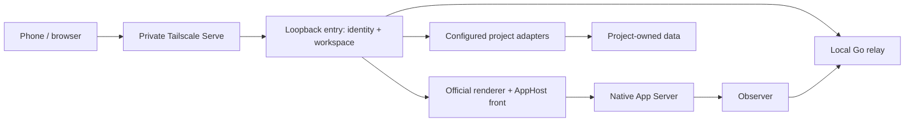

# Architecture

All listening services bind to loopback. Tailscale Serve supplies authenticated identity headers; the entry checks an explicit login allowlist, origin and workspace. Local-only use skips the network proxy. Authentication is installation-wide, not per-tenant.

Native owns execution, history and writer locking. The command journal records receipts; it does not become a second executor. The relay's disk projection is optional and rebuildable, and cannot authorize or originate a model turn. User workspaces and plugin mappings come from a single deployment file.

The frontend retains the official conversation renderer, with generated compatibility assets prepared locally from a pinned first-party download. OpenCodex supplies a separate local Electron IPC host from source. The public distribution includes the adapter and its build modifications, not official application bytes.

A foreground supervisor holds a per-installation lock and manages only the processes it creates. An external Native endpoint can be used without taking over its lifecycle. Updating a live installation is rejected. Config backups and old dependencies remain available for controlled rollback.

Project plugins either return documents or host local pages inside the workbench. Every write delegates source revision and idempotency handling to the owning adapter. Workspaces have configurable display names and roots; two stable wire slots preserve protocol compatibility.
