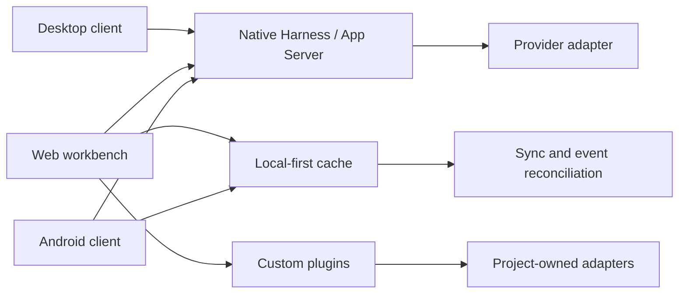

# Better Codex architecture

The workbench has a single source of truth for execution and a separate,
replaceable shell for interaction.



## Harness boundary

The public package defines a small capability surface rather than copying a
provider's private RPC implementation. A provider adapter owns authentication,
transport, and provider-specific identifiers. The workbench owns rendering,
optimistic state, navigation, and cache reconciliation.

The key rule is that the adapter returns an explicit `ConnectionState` and
monotonic event versions. A client can then distinguish:

- a message painted locally and waiting for acknowledgement;
- a message accepted by the Harness;
- a provider event that confirms the message in the canonical thread;
- a stale cache that needs reconciliation.

## Local-first cache

The cache stores bounded projections, not a second editable transcript. A
summary is enough to render a pinned list; recent message pages are fetched on
demand and can be prewarmed while the user is idle. Each record carries a
source version and observed time, so a UI can show whether it is fresh.

The flow is:

```text
paint cached projection
        ↓
subscribe to Harness events
        ↓
merge only newer versions
        ↓
read missing pages from the adapter
        ↓
persist a bounded projection
```

This makes navigation fast without allowing the cache to claim ownership of a
conversation or queue.

## Custom workbench layer

The shell provides:

- workspace selection and project-scoped navigation;
- a plugin registry for document, media, portfolio, or internal tools;
- queue and stop controls that call the Harness adapter;
- a cache/status surface for diagnosing stale or disconnected clients;
- notification routes that reuse an already mounted conversation view.

Plugins receive a scoped adapter. They do not create a shadow conversation
store, copy credentials, or infer project ownership from a browser title.

## Upgrade and reconnect model

Clients should reconnect to a stable Harness endpoint and re-read the current
thread state after reconnect. A UI restart should not create a new execution
owner. If the provider changes its transport or protocol, only the adapter
should need to change; the shell continues to consume the public contract.

The contract cannot promise that every provider survives every upgrade. It can
make the failure visible, keep the client read-only until state is known, and
avoid silently starting a competing session.
